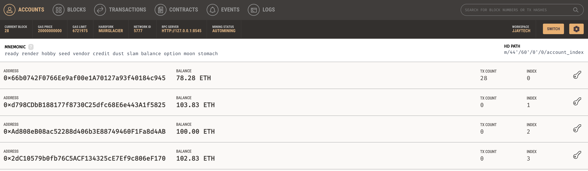
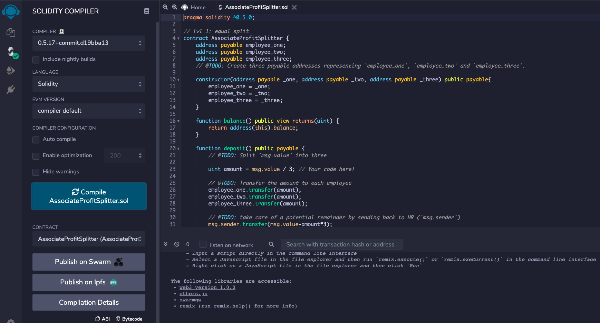
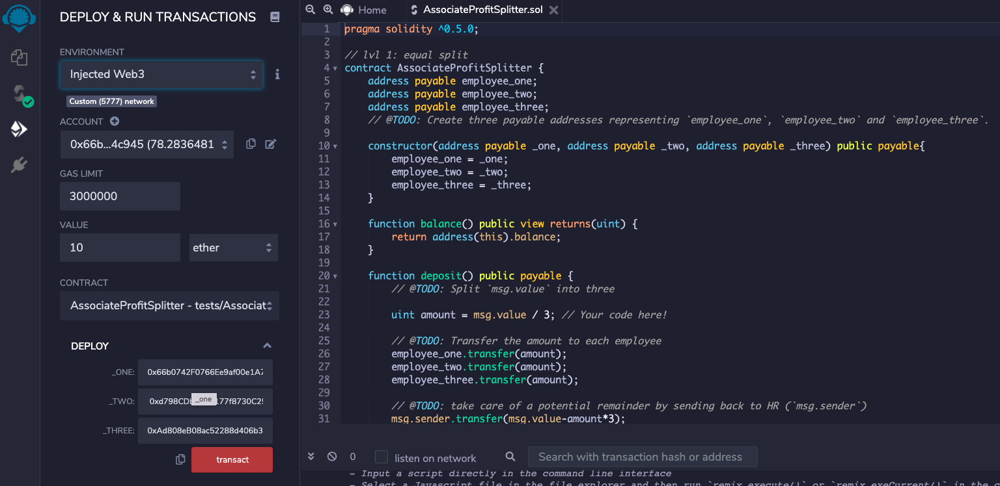
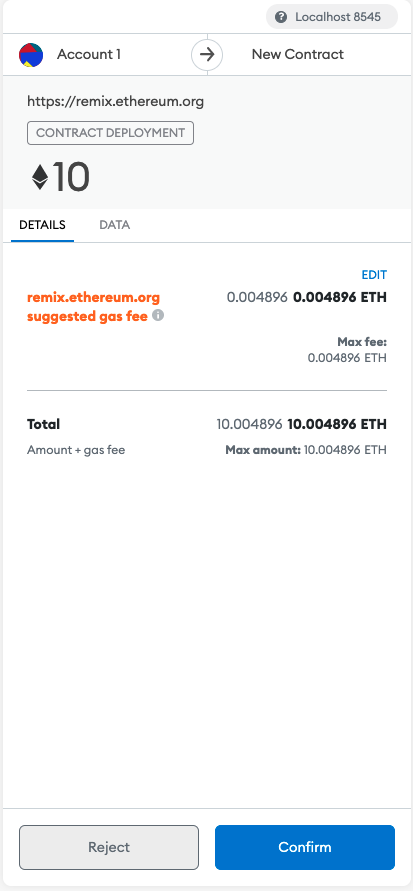

# "First Contract Associate Profit Splitter"

## Background

Your new startup has created its own Ethereum-compatible blockchain to help connect financial institutions, and the team wants to build smart contracts to automate some company finances to make everyone's lives easier, increase transparency, and to make accounting and auditing practically automatic!

Fortunately, you've been learning how to program smart contracts with Solidity! What you will be doing this assignment is creating 3 `ProfitSplitter` contracts. These contracts will do several things:

* Pay your Associate-level employees quickly and easily.

* Distribute profits to different tiers of employees.

* Distribute company shares for employees in a "deferred equity incentive plan" automatically.

## Files

* [`AssociateProfitSplitter.sol`](codes/AssociateProfitSplitter.sol) -- Level 1 starter code.

## Instructions

This assignment has three levels of difficulty, with each contract increasing in complexity and capability. Although it is highly recommended you complete all three contracts, you are only required to solve one of the three contracts. Recommended to start with Level 1, then move forward as you complete the challenges. You can build all three with the skills you already have!

* **Level One** is an `AssociateProfitSplitter` contract. This will accept Ether into the contract and divide the Ether evenly among the associate level employees. This will allow the Human Resources department to pay employees quickly and efficiently.

##            Level One: The `AssociateProfitSplitter` Contract
### ---------------------------------------------------------------------------------------------------------------

### 1) Account Balance in Ganache before Transaction

### 2) Compile Contract

#### A) Before compile

In the `Deploy` tab in Remix, deploy the contract to your local Ganache chain by connecting to `Injected Web3` and ensuring MetaMask is pointed to `localhost:8545`.

### 3) Deploy Contract

### 4) Meta Mask Confrim Transaction

### 5) Ganache Transaction Balance

