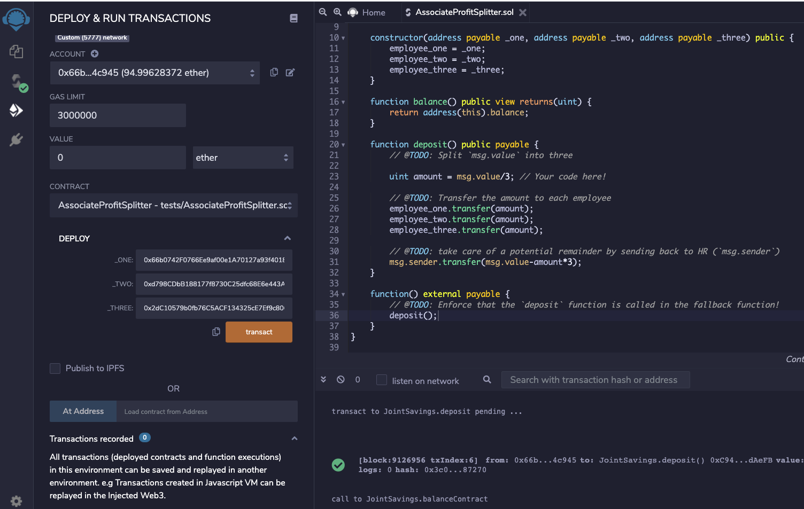
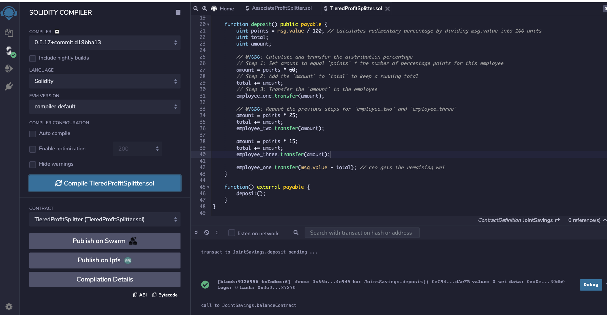
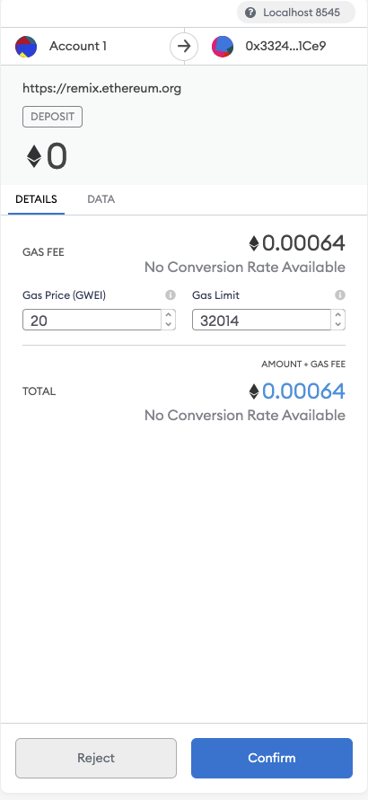
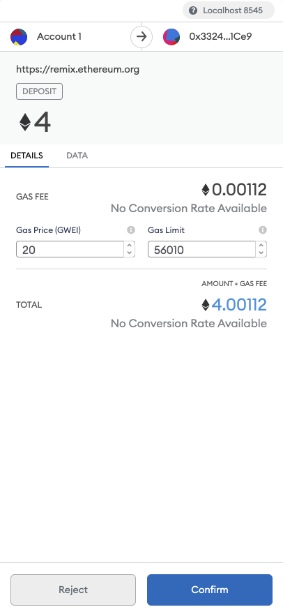
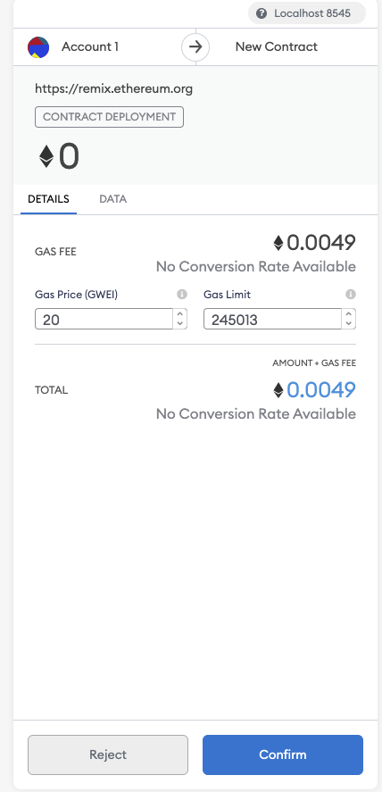
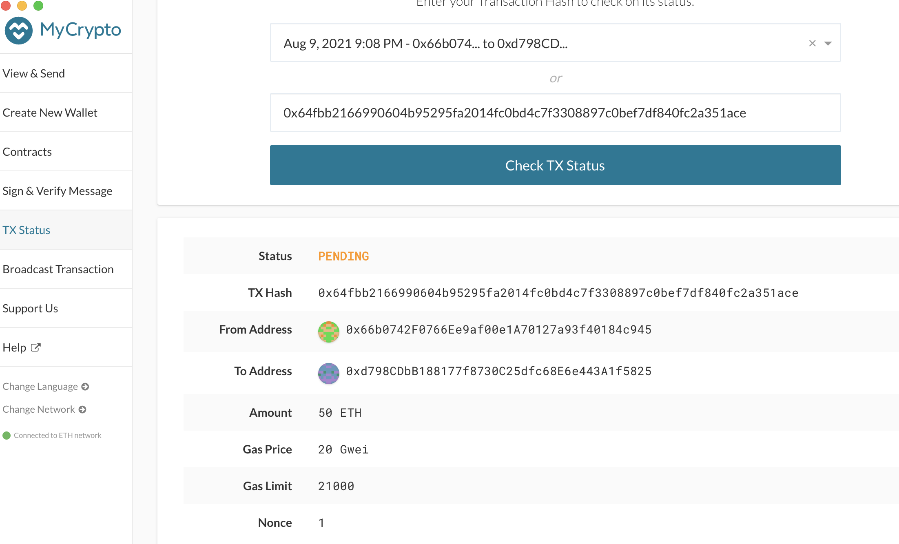
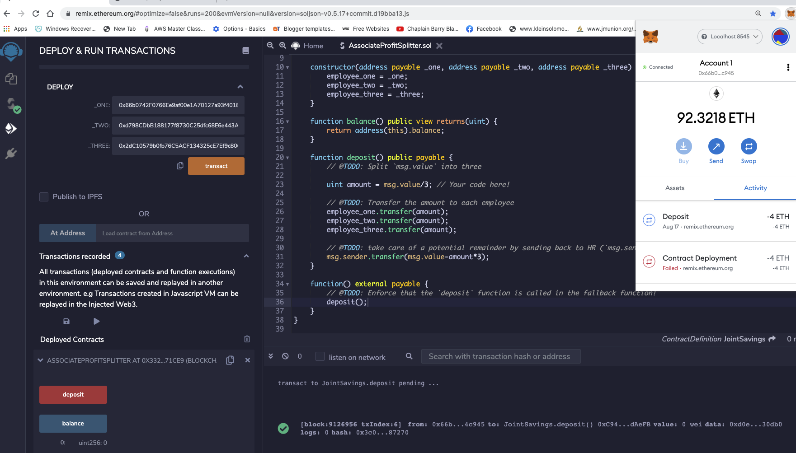
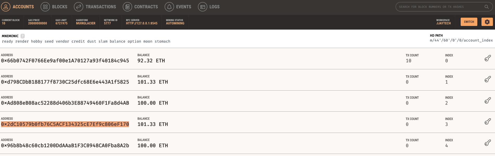

# Unit 20 - "Looks like we've made our First Contract!"

## Background

Your new startup has created its own Ethereum-compatible blockchain to help connect financial institutions, and the team wants to build smart contracts to automate some company finances to make everyone's lives easier, increase transparency, and to make accounting and auditing practically automatic!

Fortunately, you've been learning how to program smart contracts with Solidity! What you will be doing this assignment is creating 3 `ProfitSplitter` contracts. These contracts will do several things:

* Pay your Associate-level employees quickly and easily.

* Distribute profits to different tiers of employees.

* Distribute company shares for employees in a "deferred equity incentive plan" automatically.

## Files

* [`AssociateProfitSplitter.sol`](Starter-Code/AssociateProfitSplitter.sol) -- Level 1 starter code.

* [`TieredProfitSplitter.sol`](Starter-Code/TieredProfitSplitter.sol) -- Level 2 starter code.

* [`DeferredEquityPlan.sol`](Starter-Code/DeferredEquityPlan.sol) -- Level 3 starter code.

## Instructions

This assignment has three levels of difficulty, with each contract increasing in complexity and capability. Although it is highly recommended you complete all three contracts, you are only required to solve one of the three contracts. Recommended to start with Level 1, then move forward as you complete the challenges. You can build all three with the skills you already have!

* **Level One** is an `AssociateProfitSplitter` contract. This will accept Ether into the contract and divide the Ether evenly among the associate level employees. This will allow the Human Resources department to pay employees quickly and efficiently.

* **Level Two** is a `TieredProfitSplitter` that will distribute different percentages of incoming Ether to employees at different tiers/levels. For example, the CEO gets paid 60%, CTO 25%, and Bob gets 15%.

* **Level Three** is a `DeferredEquityPlan` that models traditional company stock plans. This contract will automatically manage 1000 shares with an annual distribution of 250 over 4 years for a single employee.
### Level One: The `AssociateProfitSplitter` Contract
### -------------------------------------------------

### 1) Account Balance in Ganache before Transaction

#### 2) Deploy Contract

In the `Deploy` tab in Remix, deploy the contract to your local Ganache chain by connecting to `Injected Web3` and ensuring MetaMask is pointed to `localhost:8545`.

You will need to fill in the constructor parameters with your designated `employee` addresses.

Test the `deposit` function by sending various values. Keep an eye on the `employee` balances as you send different amounts of Ether to the contract and ensure the logic is executing properly.

1

2

3

4

5

6

