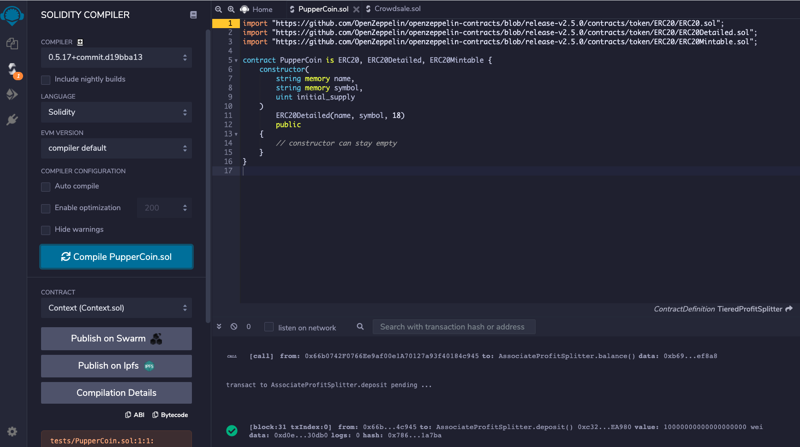

#   How to Crowdsale our PupperCoin
## ---------------------------------------------------------------------------------------------

## Background

Your company has decided to crowdsale their PupperCoin token in order to help fund the network development.
This network will be used to track the dog breeding activity across the globe in a decentralized way, and allow humans to track the genetic trail of their pets. You have already worked with the necessary legal bodies and have the green light on creating a crowdsale open to the public. However, you are required to enable refunds if the crowdsale is successful and the goal is met, and you are only allowed to raise a maximum of 300 Ether. The crowdsale will run for 24 weeks.

### Creating your project
#### 1) Create PupperCoin Contract
Using Remix, create a file called `PupperCoin.sol` and create a standard `ERC20Mintable` token. Since you're already an expert at this, you can simply use this [starter code](../Starter-Code/PupperCoin.sol).

#### 2) Create Crowdsale Contract

Leverage the [Crowdsale](../Starter-Code/Crowdsale.sol) starter code, saving the file in Remix as `Crowdsale.sol`.

You will need to bootstrap the contract by inheriting the following OpenZeppelin contracts:

* `Crowdsale`

* `MintedCrowdsale`

* `CappedCrowdsale`

* `TimedCrowdsale`

* `RefundablePostDeliveryCrowdsale`

When passing the `open` and `close` times, use `now` and `now + 24 weeks` to set the times properly from your `PupperCoinCrowdsaleDeployer` contract.

#### PupperCoinCrowdsaleDeployer

#### 3) Testing the Crowdsale

1

Test the crowdsale by sending Ether to the crowdsale from a different account (**not** the same account that is raising funds), then once you confirm that the crowdsale works as expected, try to add the token to MyCrypto and test a transaction. You can test the time functionality by replacing `now` with `fakenow`, and creating a setter function to modify `fakenow` to whatever time you want to simulate. You can also set the `close` time to be `now + 5 minutes`, or whatever timeline you'd like to test for a shorter crowdsale.

When sending Ether to the contract, make sure you hit your `goal` that you set, and `finalize` the sale using the `Crowdsale`'s `finalize` function. In order to finalize, `isOpen` must return false (`isOpen` comes from `TimedCrowdsale` which checks to see if the `close` time has passed yet). Since the `goal` is 300 Ether, you may need to send from multiple accounts. If you run out of prefunded accounts in Ganache, you can create a new workspace.

Remember, the refund feature of `RefundablePostDeliveryCrowdsale` only allows for refunds once the crowdsale is closed **and** the goal is met. See the [OpenZeppelin RefundableCrowdsale](https://docs.openzeppelin.com/contracts/2.x/api/crowdsale#RefundableCrowdsale) documentation for details as to why this is logic is used to prevent potential attacks on your token's value.

You can add custom tokens in MyCrypto from the `Add custom token` feature:

You can also do the same for MetaMask. Make sure to purchase higher amounts of tokens in order to see the denomination appear in your wallets as more than a few wei worth.

### Deploying the Crowdsale

Deploy the crowdsale to the Kovan or Ropsten testnet, and store the deployed address for later. Switch MetaMask to your desired network, and use the `Deploy` tab in Remix to deploy your contracts. Take note of the total gas cost, and compare it to how costly it would be in reality. Since you are deploying to a network that you don't have control over, faucets will not likely give out 300 test Ether. You can simply reduce the goal when deploying to a testnet to an amount much smaller, like 10,000 wei.

### Submission

Create a Github repo, and a `README.md` file explaining the process for purchasing PupperCoin (or whatever name you came up with).

Also, please provide screenshots to illustrate the functionality (e.g. how you send Ether to the contract, how you add the token to MyCrypto and test a transaction, and how you test the time functionality etc.). Alternatively, you can also record your interactions with the contract as a gif (e.g. https://www.screentogif.com/)

Ensure that anyone can run the steps and add the token to MyCrypto, or a similar wallet.

Include information such as the token parameters, token name, crowdsale cap, etc.

---

### Requirements
#### Deploying the Contracts  (30 points)

##### To receive all points, your code must:

* Set up the ERC20 PupperCoin contract. (6 points)
* Set up the PupperCoinCrowdsale with the assigned criteria. (8 points)
* Customize or hardcode the Crowdsale Rate. (8 points)
* Model the PupperCoinCrowdsaleDeployer after the ArcadeTokenCrowdsaleDeployer. (8 points)

#### Testing the Crowdsale  (40 points)

##### To receive all points, your code must:

* Test the Crowdsale by sending ether to a different account, then add screenshots of this to the ReadME.md. (10 points)
* Set up the Crowdsale's finalize function with the assigned criteria. (10 points)
* Properly set up the RefundablePostDeliveryCrowdsale. (10 points)
* Deploy the Crowdsale to either the Kovan or Ropsten testnet, then add screenshots of this to the ReadMe.md. (10 points)

#### Coding Conventions and Formatting (10 points)

##### To receive all points, your code must:

* Place imports at the beginning of the file, just after any module comments and docstrings and before module globals and constants. (3 points)
* Name functions and variables with lowercase characters and with words separated by underscores. (2 points)
* Follow Don't Repeat Yourself (DRY) principles by creating maintainable and reusable code. (3 points)
* Use concise logic and creative engineering where possible. (2 points)

#### Deployment and Submission (10 points)

##### To receive all points, you must:

* Submit a link to a GitHub repository that’s cloned to your local machine and contains your files. (5 points)
* Include appropriate commit messages in your files. (5 points)

#### Code Comments (10 points)

##### To receive all points, your code must:

* Be well commented with concise, relevant notes that other developers can understand. (10 points)

---

© 2021 Trilogy Education Services, a 2U, Inc. brand. All Rights Reserved.

kMDItemIsScreenCapture:1