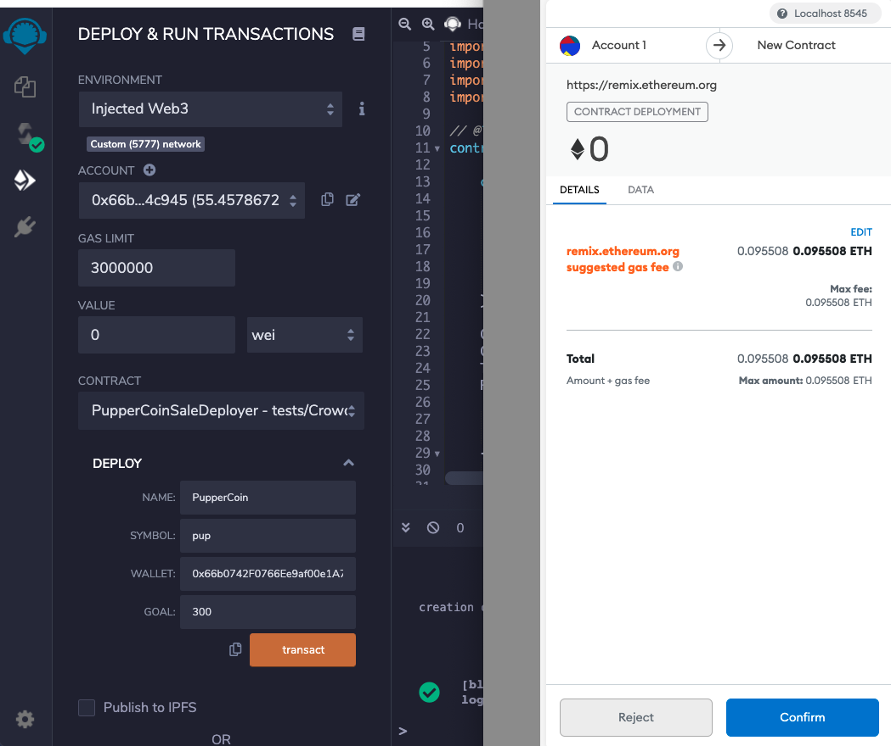
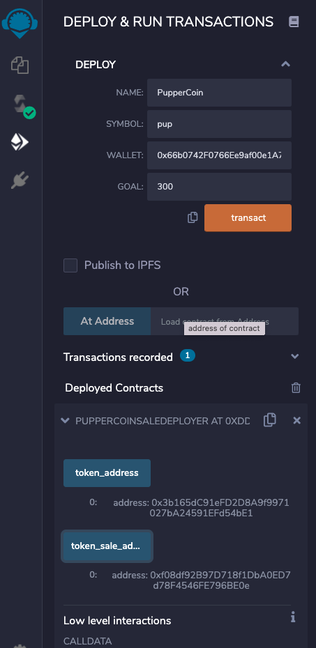
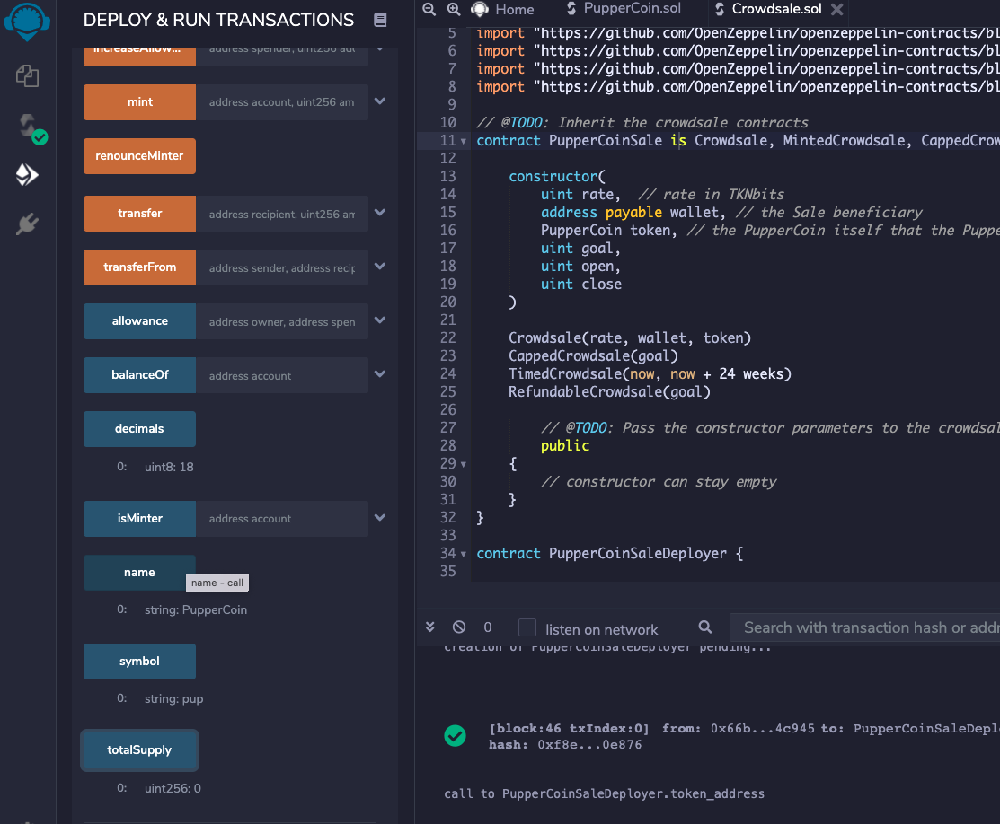
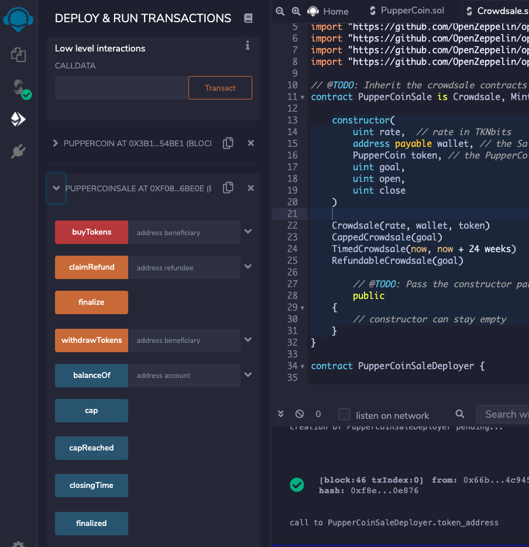
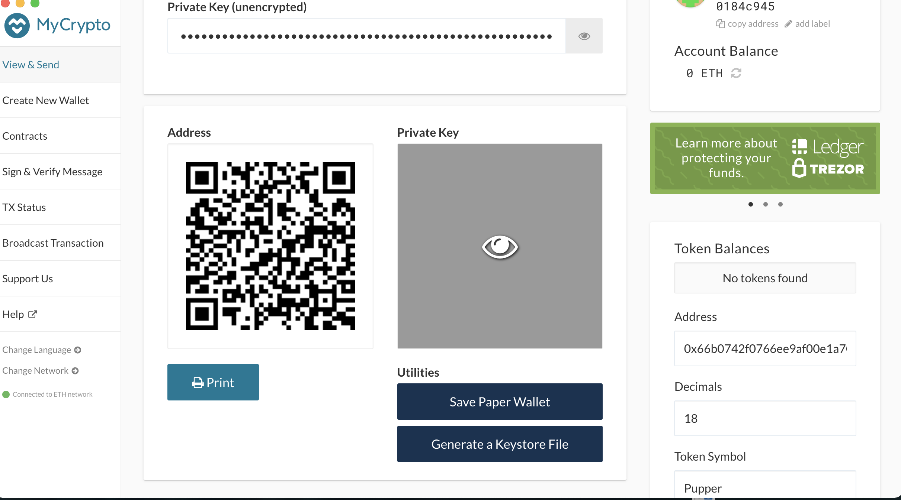
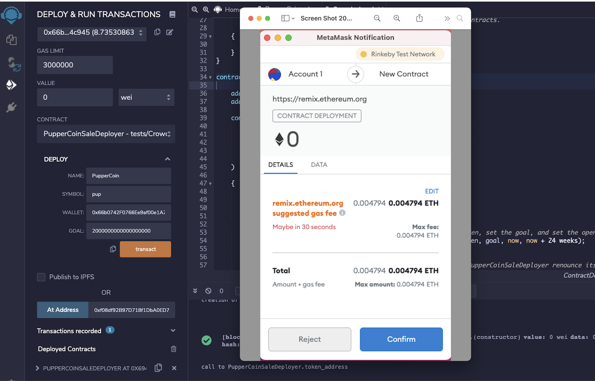
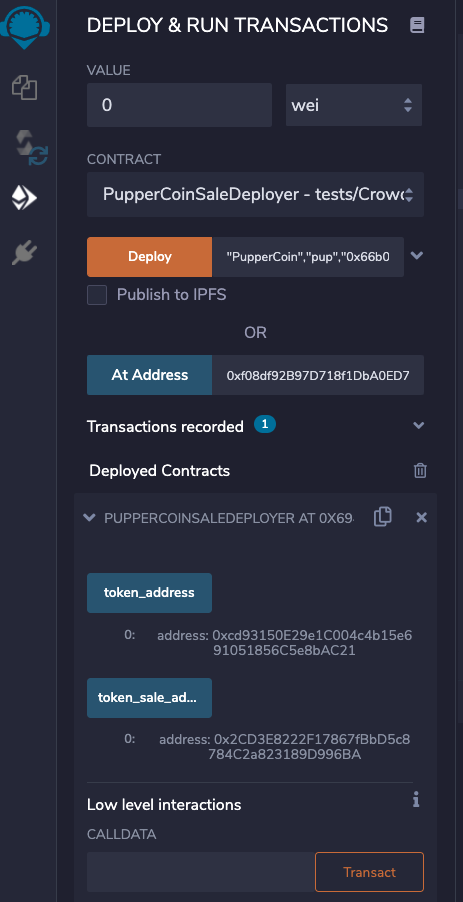
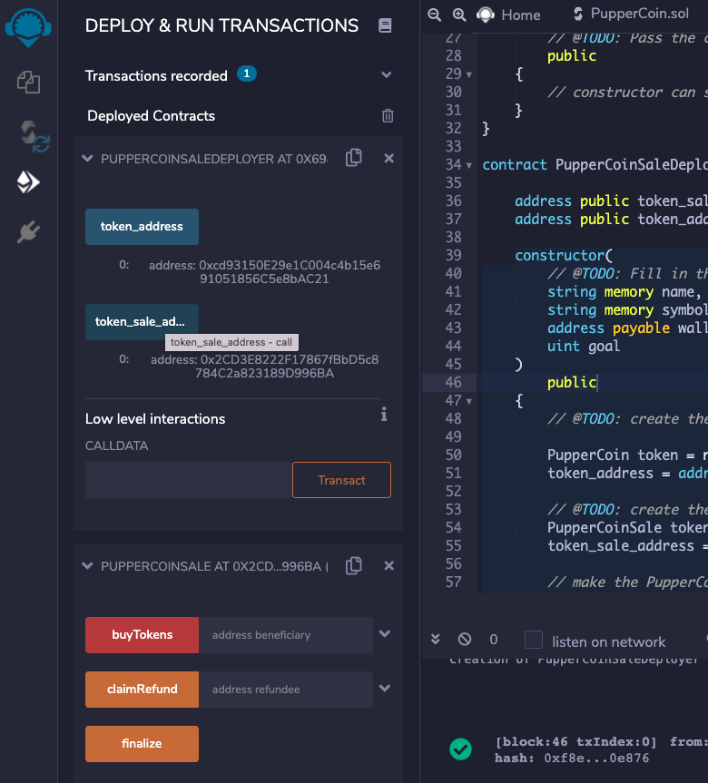
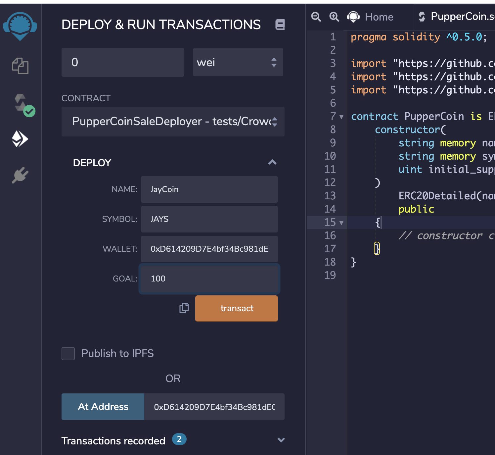
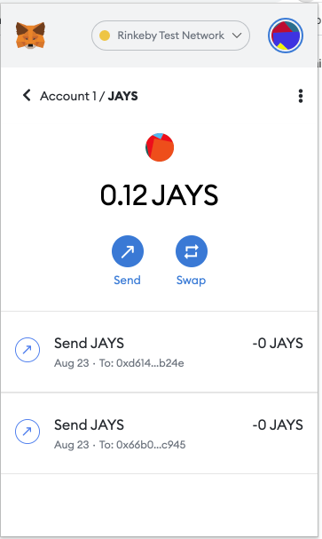

#   How to Crowdsale our PupperCoin
## ---------------------------------------------------------------------------------------------

## Background

Your company has decided to crowdsale their PupperCoin token in order to help fund the network development.
This network will be used to track the dog breeding activity across the globe in a decentralized way, and allow humans to track the genetic trail of their pets. You have already worked with the necessary legal bodies and have the green light on creating a crowdsale open to the public. However, you are required to enable refunds if the crowdsale is successful and the goal is met, and you are only allowed to raise a maximum of 300 Ether. The crowdsale will run for 24 weeks.

### Creating your project
#### 1) Create PupperCoin Contract
Using Remix, create a file called `PupperCoin.sol` and create a standard `ERC20Mintable` token. Since you're already an expert at this, you can simply use this [starter code](../Starter-Code/PupperCoin.sol).

#### 2) Create Crowdsale Contract

Leverage the [Crowdsale](../Starter-Code/Crowdsale.sol) starter code, saving the file in Remix as `Crowdsale.sol`.

You will need to bootstrap the contract by inheriting the following OpenZeppelin contracts:

* `Crowdsale`

* `MintedCrowdsale`

* `CappedCrowdsale`

* `TimedCrowdsale`

* `RefundablePostDeliveryCrowdsale`

When passing the `open` and `close` times, use `now` and `now + 24 weeks` to set the times properly from your `PupperCoinCrowdsaleDeployer` contract.

#### 4) PupperCoinCrowdsaleDeployer

### Testing the Crowdsale: Localhost8545

#### 1) Return PupperCoin and PupperSales Address

#### 2) PupperCoin Token Contract

#### 3) PupperCoinSale contract deployed

#### 4) Mycrypto Token

-----------------------

### Testing the Crowdsale: Rinkeby Tesnet

1----

2----

3-----

4----

5

kMDItemIsScreenCapture:1