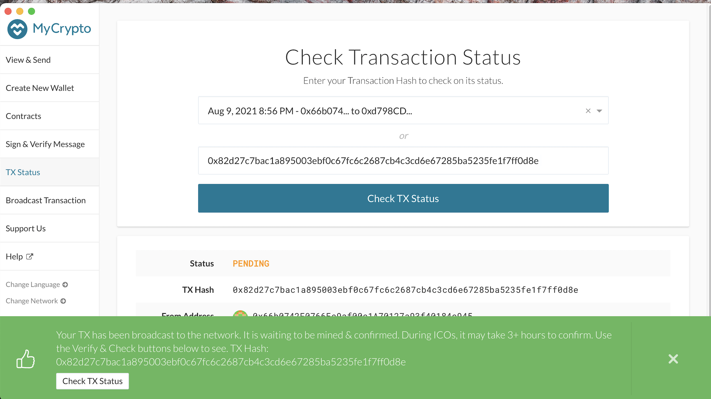
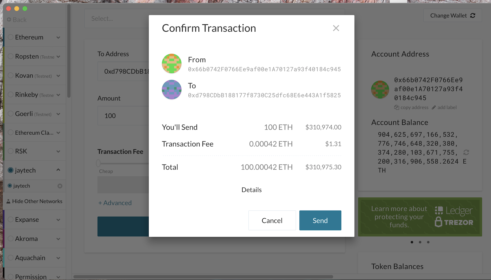
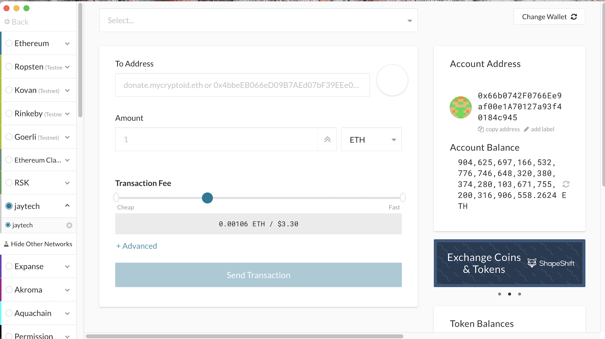

r# Proof of Authority Development Chain

1. The first order of businesss is to downloading Go Ethereum Tools from https://geth.ethereum.org/downloads/
2. We decompress Go Ethereum and rename the folder as Blockchain-tools
3. In case of deploying Clique Algorithm, nodes have to created first then creating a network unlike Proof of Work.

- Using geth command, we create node1 as node1 

        ./geth account new --datadir node1
- my node 2 is name node2.
- After running the geth command we are then prompoted to set a password twice
- I place the generate public address key and path of secret key file in a text file see screenshot
- 

1. Initiate the puppeth command to start building our network:
   
        ./puppeth
2. Sepcify the network name as Jaytech 
3. Next step is to build new genesis from scratch and to select Clique (PoA) as consensus engine
4. Then we will be asked how many seconds should block take. I chose 7 seconds as I only have 2 nodes
5. Sealer accounts are the voting nodes. Copy & paste public address of at least one node
6. At least one account has to be refunded.
7. Then, will be asked to specify network ID
8. Next is to manage our existing genesis to export the genesis configurations on the local directory; which consist of 4 json files:
   - jaytech.json 
   - jaytech-harmony.json
   

9.  Now, it's time to initiate our nodes, opening two different git bash windows.. will run this command

        ./geth init jaytech.json --datadir node1
        ./geth init jaytech.json --datadir node2

10. Mining time for node1 and run the following command and will be required to enter the node password

        ./geth --datadir nodename --mine --minerthreads 1

aaron (node 1) P2P network was displayed in screenshot above, notice port for instance starts at 30303 essentially P2P network generated for second node will be 30304:

        Started P2P networking                   
        /geth --datadir node1 --unlock "bF1a90CF213618Ca9bFC75d2E404c850e8426BC7" --mine --minerthreads 1

11.    to start mining in node2 password will be required to unlock account.

node 2 P2P network has to be fetched & stored as well

    Started P2P networking                   
    ./geth --datadir node2 --unlock "406bAc63532aE2780c613cc3187be9b1945c7D20" --port 30304 --rpc --bootnodes "enode://2b20eb9c29bec16c0098310e14f1e6e3411d80f9975eb72853baceadd2744d8f82ec395381590846cfb7f510a186494926433c782ba73b5172cc60a1a1088c32@127.0.0.1:30303" --ipcdisable --allow-insecure-unlock

12. It's time to create custom nodes on my crypto app:
    
    - from Change Network in my crypto app
  
  
    
- select Add custom node

- will enter the first node name in the crossponding box
- network name is jaytech
- currency is ethereum
- chain ID is the network ID we specify in no. 7
- url is  "http:/127.0.0.1:8545"
- click save & use custom node
- will do the exact same steps for the second node

- navigate back to my crypto to start uploading keystore file for each node individually

- Check Transaction Status

13. Confirm for Transaction Status

14. Transaction Balance

